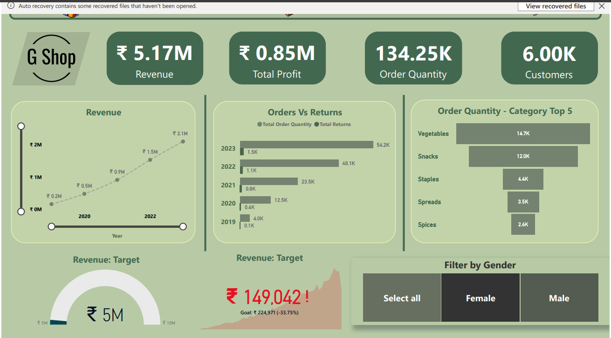
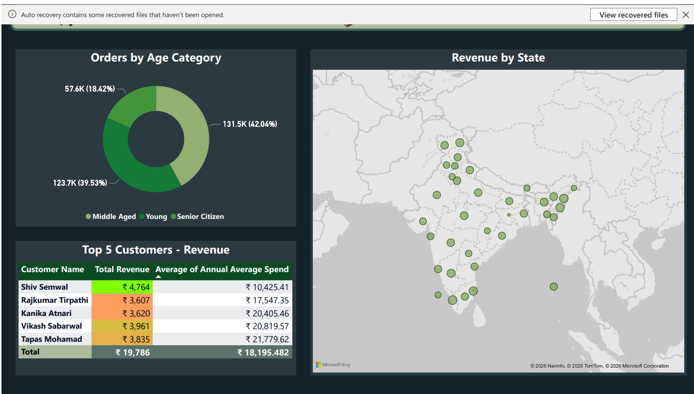
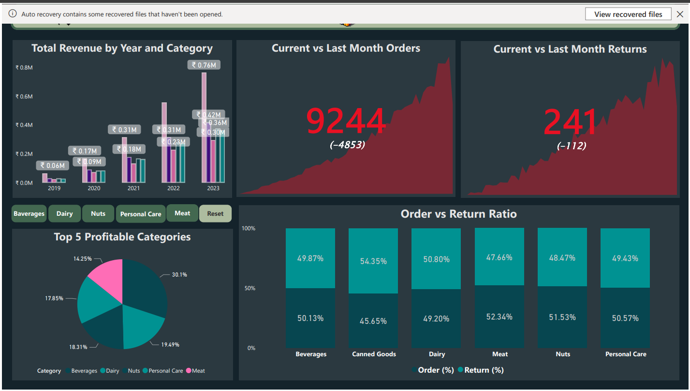

# 🛒 G Shop Sales Analysis Dashboard | Power BI

## 📌 Overview

The **G Shop Sales Analysis Dashboard** is an interactive Power BI project developed to analyze sales performance, customer behavior, product categories, and regional trends. The dashboard presents business data in a clear and interactive format, making it easier to monitor key metrics and identify opportunities for improvement.

The report is divided into multiple pages, with each page focusing on a different aspect of the business.

---

# 🎯 Project Objectives

- Monitor overall business performance.
- Track revenue and profit growth over time.
- Compare orders with product returns.
- Identify the best-performing product categories.
- Analyze customer demographics.
- Understand sales distribution across different states.
- Measure monthly order and return performance.

---

# 📊 Dashboard Pages

## 1️⃣ Executive Dashboard

This page provides a high-level summary of business performance.

### Key Performance Indicators (KPIs)

- 💰 Total Revenue
- 📈 Total Profit
- 📦 Order Quantity
- 👥 Total Customers

### Visualizations

- Revenue Trend
- Orders vs Returns
- Top 5 Categories by Order Quantity
- Revenue Target Gauge
- Revenue Target Achievement
- Gender Filter

---

## 2️⃣ Customer & Regional Analysis

This page focuses on customer insights and geographical performance.

### Visualizations

- Revenue by State (Map)
- Orders by Age Category
- Top 5 Customers by Revenue
- Average Annual Customer Spend

---

## 3️⃣ Product Performance Dashboard

This page highlights category performance and monthly trends.

### Visualizations

- Total Revenue by Year and Category
- Current vs Last Month Orders
- Current vs Last Month Returns
- Top 5 Profitable Categories
- Order vs Return Ratio

---

# 📈 Key Metrics

- Total Revenue
- Total Profit
- Order Quantity
- Customer Count
- Revenue Target
- Monthly Orders
- Monthly Returns
- Order vs Return Percentage

---

# 🎛 Interactive Features

The dashboard includes interactive filters for:

- Gender
- Product Category
- Year

Selecting a filter automatically updates all related visuals across the report.

---

# 🛠 Tools & Technologies

- Microsoft Power BI
- Power Query
- DAX (Data Analysis Expressions)
- Data Modeling
- Interactive Visualizations

---

# 📐 DAX Measures

Some of the measures used in this project include:

- Total Revenue
- Total Profit
- Order Quantity
- Customer Count
- Revenue Target
- Current Month Orders
- Last Month Orders
- Current Month Returns
- Last Month Returns
- Order vs Return Ratio
- Profit Percentage

---

# 💡 Business Insights

- Revenue has increased steadily over the years.
- Vegetables recorded the highest order quantity among all product categories.
- Middle-aged customers contributed the largest share of total orders.
- A small group of customers generated a significant portion of total revenue.
- Monthly orders consistently exceeded product returns.
- Return ratios vary across product categories, indicating opportunities for operational improvement.

---

# 🚀 Skills Demonstrated

- Data Cleaning
- Data Transformation
- Data Modeling
- DAX Calculations
- Dashboard Design
- KPI Development
- Business Intelligence
- Data Visualization
- Interactive Reporting

---

# 📂 Project Structure

```text
G-Shop-Sales-Dashboard/
│
├── Dashboard.pbix
├── Dataset/
├── Images/
│   ├── Dashboard1.png
│   ├── Dashboard2.png
│   └── Dashboard3.png
└── README.md
```

---

# 🖼 Dashboard Preview

## Executive Dashboard



---

## Customer & Regional Analysis



---

## Product Performance Dashboard



---

# 🔮 Future Enhancements

- Add sales forecasting.
- Build customer retention analysis.
- Create drill-through reports.
- Connect to a live SQL database.
- Develop a mobile-friendly report layout.

---

# 📚 Conclusion

This Power BI dashboard provides a complete view of G Shop's sales performance through interactive reports and meaningful business insights. It combines revenue analysis, customer segmentation, product performance, and regional sales into a single reporting solution that supports informed decision-making.

---

## ⭐ If you found this project helpful, consider giving it a star!
